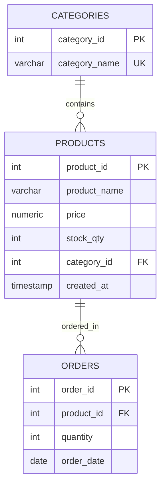

# Azure Database for PostgreSQL Deployment Assignment

## Overview
This repository contains the deployment configurations, architectural decisions, and database schemas for the **Azure Database for PostgreSQL Flexible Server** assignment. 

The goal of this project is to provision a fully managed relational database, configure secure public and private network layers, write and execute relational schema scripts (DDL) and transactional operations (DML), configure enterprise security controls (TLS & Microsoft Entra ID), and evaluate backup, restore, and monitoring options.

---

## Server Deployment Configuration

The PostgreSQL server was provisioned with the following parameters designed to satisfy workload requirements while remaining within free-tier limits:

| Parameter | Configuration Choice | Description / Rationale |
| :--- | :--- | :--- |
| **Server Name** | `psql-lab-olamileye` | Globally unique name identifying the host. |
| **Deployment Option**| Flexible Server | Chosen to support maximum database control, custom maintenance windows, burstable compute, and VNet integration. |
| **Resource Group** | `rg-postgres-lab` | Logical container organizing all database-related resources together. |
| **Region** | `West Europe` | Selected to optimize network latency for training workloads. |
| **PostgreSQL Version**| `16` | Latest General Availability (GA) engine version. |
| **Compute Tier** | Burstable, `B1ms` | Standard burstable tier providing 1 vCore and 2 GiB RAM, covered under the Azure Free Tier. |
| **Storage Capacity** | `32 GiB` | Minimum size allocation covered under the Free Tier. |
| **High Availability** | Disabled | Not required for development/testing workloads to minimize cost. |
| **Admin Username** | `pgadmin` | Custom administrative account (avoiding defaults like `postgres` or `admin`). |

---

## Security & Networking Configuration

To align with modern cloud-security practices (Defense in Depth), access is restricted at both the network and credential levels.

### 1. Networking (Public & Private Access)
* **Firewall Configuration**: Configured connection security to restrict public endpoints. Initial testing was enabled through a firewall rule named `AllowMyDevIP` that restricts public access exclusively to the developer's workstation public IP address.
* **Virtual Network (VNet) Integration**: Integrated the server into a private subnet to eliminate internet exposure:
  * **Virtual Network Name**: `vnet-postgres-lab` (Address Space: `10.0.0.0/16`)
  * **Subnet**: `snet-db` (Address Range: `10.0.1.0/24`)
  * **Private Endpoint**: `pe-psql-lab`
  * **Private DNS Zone**: Integrated with `privatelink.postgres.database.azure.com` to resolve the server hostname to a private network IP (e.g., `10.0.1.5`).

### 2. Encryption and Authentication Settings
* **Enforced TLS (Transport Layer Security)**: 
  * Parameter `ssl = ON` is enabled.
  * Server parameters are configured with `require_secure_transport = ON` and `ssl_min_protocol_version = TLSv1.2` to reject unencrypted connections.
* **Microsoft Entra ID (Azure AD) Authentication**: 
  * Authentication mode set to **PostgreSQL and Microsoft Entra authentication**.
  * Configured active user identity as Microsoft Entra administrator.
  * Supported connection via tokens retrieved dynamically through Azure CLI:
    ```bash
    az login
    token=$(az account get-access-token --resource https://ossrdbms-aad.database.windows.net --query accessToken -o tsv)
    PGPASSWORD=$token psql -h psql-lab-olamileye.postgres.database.azure.com -U your-email@domain.com -d postgres --sslmode=require
    ```

---

## Schema Design & Database Operations

The database objects and relational integrity constraints are fully defined in the [schema.sql](schema.sql) file. The schema models a basic inventory/order tracking system:



### Verification CRUD Workflow:
1. **Create**: Lookup items were inserted into `categories`, followed by items into `products`, and transactional entries into `orders`.
2. **Read**: Evaluated queries joining products with categories, sorted by price.
3. **Update**: Modified the pricing and inventory parameters for the `'Ergonomic Chair'` product.
4. **Delete**: Tested constraint cascading by deleting the `'Notebook A4'` product and verifying referential integrity.

---

## Infrastructure Scaling & Monitoring

### 1. Compute and Storage Scaling
* **Compute Scaling**: Successfully tested scaling up from a Burstable `B1ms` (1 vCore) to a `B2ms` (2 vCores) to accommodate traffic load simulation. Scale operations require a short server restart (~2 minutes).
* **Storage Scaling**: Increased storage capacity online from `32 GiB` to `64 GiB`. Storage allocations can only scale upwards.
* **Storage Auto-grow**: Enabled Storage Auto-grow, allowing Azure to automatically allocate additional disk space when usage reaches 85% of capacity.

### 2. Monitoring & Alerts
* **Azure Monitor Metrics**: Used Metrics explorer to monitor CPU usage, memory percentage, active connections, and network I/O.
* **Alert Rule**: Configured a threshold alert rule:
  * **Condition**: CPU Percentage > 80%
  * **Evaluation Period**: 5 Minutes
  * **Action**: Email notification sent to the administrator.
* **Query Performance Insight**: Utilized the built-in Intelligent Performance dashboard to analyze slow-running queries and inspect execution paths.

---

## Backup and Restoration

* **Backup Configuration**: The database backup retention window was verified to be `7 days` (min retention under Free Tier) using Locally Redundant Storage (LRS).
* **Point-in-Time Restore (PITR)**: Verified restore capability by launching a point-in-time restoration from a backup snapshot. The restoration was targeted to a separate instance named `psql-lab-restored` within the same region, confirming complete data recovery.

---

## Submission Artifacts & Verification

Below are the visual verifications for the steps executed on the Azure Portal and local development client.

### 1. Successfully Deployed PostgreSQL Flexible Server
Shows the active status, compute resources, and connection endpoints of the server.


### 2. Configured Firewall and Private Link Settings
Shows the networking settings, Public Access controls (including the `AllowMyDevIP` firewall rule), and the Private Endpoint (`pe-psql-lab`) successfully configured inside the virtual network subnet (`snet-db`).


### 4. Client Connection Proof
Verifies successful connection to the PostgreSQL database from a local client using pgAdmin 4 showing the database schemas.

