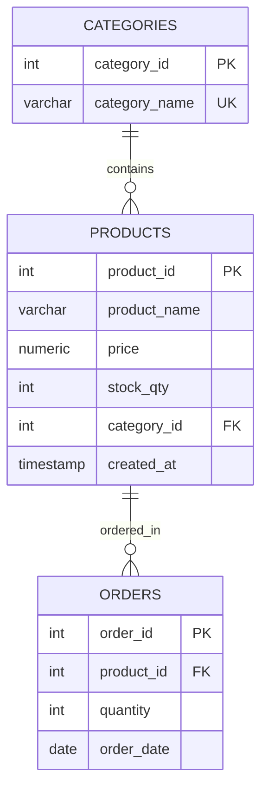

# PostgreSQL Flexible Server Deployment on Azure

## What This Project Covers

This repo documents the end-to-end deployment of an **Azure Database for PostgreSQL Flexible Server**, along with the reasoning behind each architectural decision and the schema built on top of it.

Across the assignment, the following was accomplished: stand up a managed relational database instance, layer in both public and private networking paths, build out the relational schema (DDL) and exercise it with real transactions (DML), lock down access using TLS and Microsoft Entra ID, and walk through the available options for backups, point-in-time recovery, and ongoing monitoring.

---

## How the Server Was Provisioned

Every setting below was chosen with two goals in mind: keep the deployment inside Azure's free-tier limits, and still meet the workload's functional requirements.

**Identity & Location**
- Hostname: `psql-lab-olamileye` — a globally unique identifier for the server.
- Resource group: `rg-postgres-lab`, used to keep all related resources grouped together.
- Region: `West Europe`, chosen to keep latency low for the training workload.

**Compute & Storage**
- Deployment model: **Flexible Server**, picked over the alternatives because it allows custom maintenance windows, burstable compute, and direct VNet integration.
- Engine version: PostgreSQL `16`, the current GA release.
- Compute tier: Burstable `B1ms` (1 vCore / 2 GiB RAM) — the tier covered by the Azure Free Tier.
- Storage: `32 GiB`, the minimum allocation under the Free Tier.

**Access & Availability**
- High availability: turned off, since a dev/test workload doesn't justify the added cost.
- Admin account: `pgadmin` — deliberately not named `postgres` or `admin` to avoid an easily-guessable default.

---

## Locking Down Security & Network Access

The setup follows a defense-in-depth approach, meaning access is gated at both the network layer and the credential layer rather than relying on just one.

### Network Access: Public and Private Paths

For initial testing, public access was narrowed down to a single allowed source: a firewall rule called `AllowMyDevIP`, which only permits traffic from the developer's own workstation IP.

For anything beyond initial testing, the server was pulled fully off the public internet via VNet integration:

- Virtual network: `vnet-postgres-lab` (address space `10.0.0.0/16`)
- Subnet: `snet-db` (address range `10.0.1.0/24`)
- Private endpoint: `pe-psql-lab`
- Private DNS zone: linked to `privatelink.postgres.database.azure.com`, which resolves the server's hostname to an internal address (e.g., `10.0.1.5`) instead of a public one.

### Encryption and Identity-Based Authentication

Connections are encrypted end-to-end, and credentials are not limited to passwords alone:

- TLS is mandatory: `ssl = ON`, paired with `require_secure_transport = ON` and a minimum protocol floor of `ssl_min_protocol_version = TLSv1.2`. Any unencrypted connection attempt is rejected outright.
- Authentication mode is set to **PostgreSQL and Microsoft Entra authentication**, with the active Azure identity configured as the Entra administrator on the server.
- Token-based login via Azure CLI was confirmed working end-to-end:

  ```bash
  az login
  token=$(az account get-access-token --resource https://ossrdbms-aad.database.windows.net --query accessToken -o tsv)
  PGPASSWORD=$token psql -h psql-lab-olamileye.postgres.database.azure.com -U your-email@domain.com -d postgres --sslmode=require
  ```

---

## Database Schema and CRUD Validation

The full set of tables and integrity constraints lives in [schema.sql](schema.sql). It models a simple inventory and order-tracking system, shown below:



To confirm the schema actually works end-to-end, all four CRUD operations were exercised:

- **Insert**: categories loaded first, then products tied to those categories, then order records referencing those products.
- **Query**: products joined against categories and sorted by price, to confirm the relationships resolve correctly.
- **Update**: price and stock quantity adjusted on the `'Ergonomic Chair'` product.
- **Delete**: the `'Notebook A4'` product was removed specifically to confirm cascading constraints and referential integrity held up as expected.

---

## Scaling the Server and Watching It Run

### Adjusting Compute and Storage

- Compute was scaled up from Burstable `B1ms` (1 vCore) to `B2ms` (2 vCores) under simulated load, with the change requiring roughly a 2-minute restart.
- Storage was increased online from `32 GiB` to `64 GiB` — note that storage can only be scaled upward, never back down.
- Storage Auto-grow was switched on, so Azure expands disk space automatically once usage crosses the 85% mark.

### Keeping an Eye on Health

- Azure Monitor's Metrics explorer was used to track CPU load, memory percentage, active connection count, and network I/O.
- An alert rule was set up to flag sustained CPU pressure: it triggers when CPU usage stays above 80% for a 5-minute window, and fires off an email to the administrator when it does.
- Query Performance Insight's dashboard was used to spot slow-running queries and review their execution paths.

---

## Backup Strategy and Point-in-Time Recovery

Backup retention was confirmed at `7 days` — the minimum window allowed under the Free Tier — backed by Locally Redundant Storage (LRS).

Point-in-time restore was also tested directly: a restoration was triggered from a backup snapshot into a brand-new instance, `psql-lab-restored`, deployed in the same region. The restored instance came back with all data intact, confirming the recovery path works as expected.

---

## Proof of Work: Screenshots

The images below back up the steps described above, captured directly from the Azure Portal and from a local development client.

**Server provisioned and running**
Confirms the server's active status, its assigned compute resources, and its connection endpoint.


**Network access configured (firewall + private link)**
Shows the public-access firewall rule (`AllowMyDevIP`) alongside the private endpoint (`pe-psql-lab`) successfully landed inside the `snet-db` subnet.


**Client successfully connected**
Confirms a working connection from a local pgAdmin 4 client, with the database schema visible and browsable.

